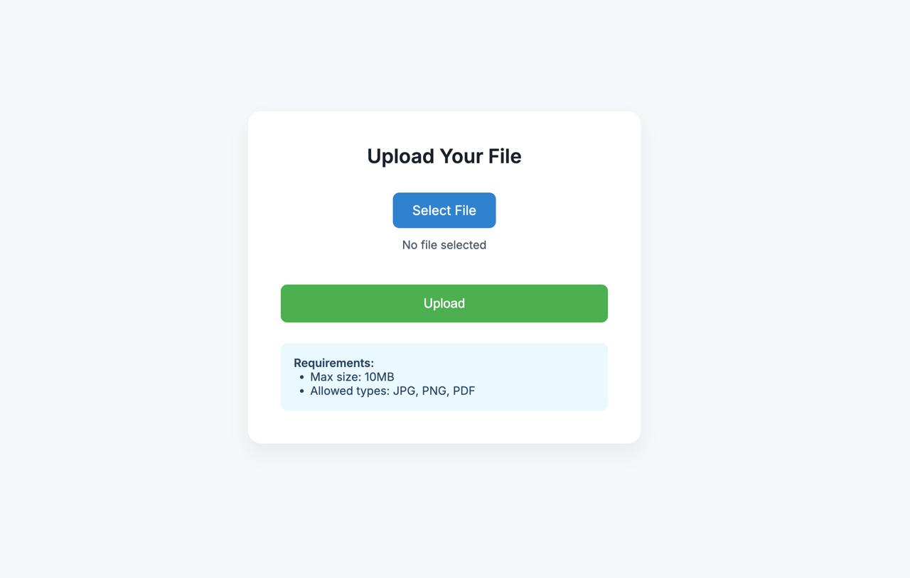
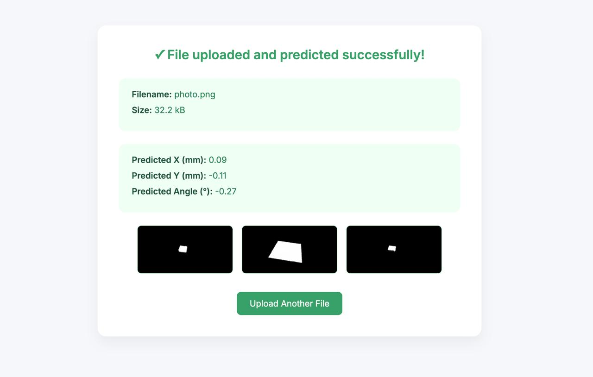

# AI-for-laser-processing


__дерево проекта__
```
.
├── Dockerfile
├── README.md
├── ai_service
│   ├── Dockerfile
│   ├── app.py
│   ├── laser_model600.pth
│   ├── model_ai.py
│   └── requirements.txt
├── docker-compose.yml
├── go.mod
├── go.sum
├── main.go
├── predictions
├── templates
│   ├── error.html
│   ├── index.html
│   ├── multiple-result.html
│   ├── multiple.html
│   └── success.html
└── uploads
```

### Где что лежит?

- ai_service - ИИ модель с адапитованым под нее API 
- templates - шаблоны для веб страниц 
- в главной директории лежит backend приложения на golang и docker-compose 


### Как запускать?

В проекте подключен докер, так что достаточно просто запустить его 

```bash
$ sudo docker compose up --build -d 
```
все подключится и будет доступо либо в общей сети по адресу http://ip:8080, либо по http://127.0.0.1:8080

### Как выглядит?


Главная страница


Страница вывода результата


### Краткое описание решения 

