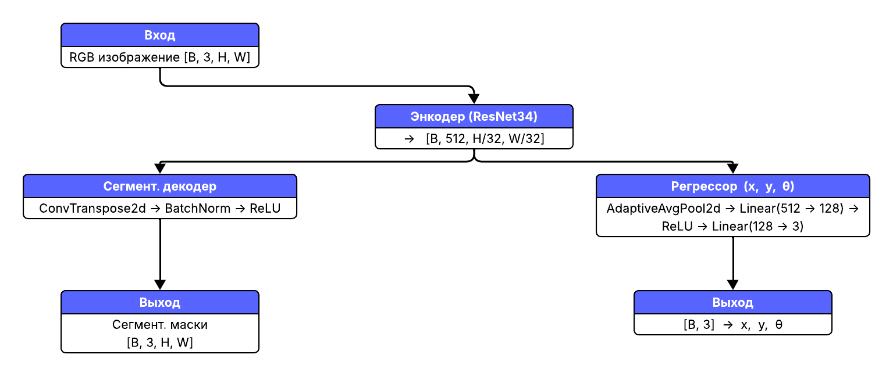

# AI-for-laser-processing

#### s5Xr4y5Piw team


Дерево проекта
```
.
├── Dockerfile
├── README.md
├── ai_service
│   ├── Dockerfile
│   ├── app.py
│   ├── laser_model_mk2.pth
│   ├── model_ai.py
│   └── requirements.txt
├── docker-compose.yml
├── go.mod
├── go.sum
├── main.go
├── neural_network_source
│   └── src.ipynb
├── predictions
├── preza
│   └── AI-for-laser-processing(s5Xr4y5Piw-team).pdf
├── screens
│   ├── ERD.png
│   ├── main_page.jpg
│   └── result_page.png
├── templates
│   ├── error.html
│   ├── index.html
│   ├── multiple-result.html
│   ├── multiple.html
│   └── success.html
└── uploads
```
### Где что лежит?

- ai_service - ИИ модель с адапитованым под нее API 
- templates - шаблоны для веб страниц 
- в главной директории лежит backend приложения на golang и docker-compose 
- neural_network_source - исходник модели
- preza - лежит презентация на проект

## План решения

- Изучить данные, пересобрать датасет + удобная архитектура
- Предобработка изображений, масок
- Написание модели
- Написание сервиса


### Пересоберем датасет

Соберем удобную для обучения архитектуру
```
dataset
├── images
│   ├── train
│   └── val
├── labels.csv
└── masks
    ├── train
    └── val
```
### Предобработка изображений, масок

- Чтение PNG в градациях серого

- Улучшение контрастности (CLAHE)

- Сглаживание (Gaussian Blur)

- Изменение размера до 512×256 пикселей.

#### Нормализация и преобразование

- перевод в диапазон [0, 1],

- дублирование в 3 канала (имитация RGB),

- преобразование в тензор для модели [1, 3, H, W].

### Написание модели

Для оптимизации решения задачи, мы решили использовать *multi-task neural network*



#### Метрика
(val loss = 24.8881, IoU = 0.933, RMSE = 0.70)

## Как запускать?

В проекте подключен докер, так что достаточно просто запустить его 
```bash
$ sudo docker compose up --build -d
``` 
все подключится и будет доступо либо в общей сети по адресу http://ip:8080, либо по http://127.0.0.1:8080

## Как выглядит?


### Главная страница


### Страница вывода результата
